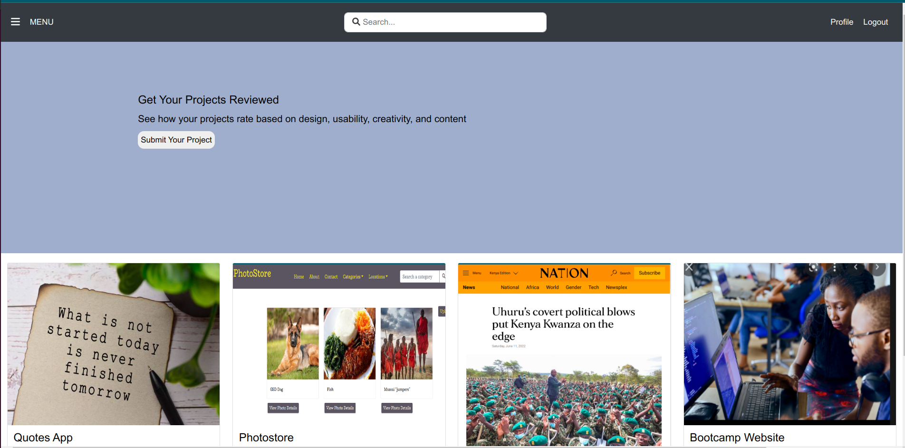

# Project Rating

Project Rating is web application that allows software developers to post their projects and get them rated by their peers based on design, usability, creativity, and content.

### By **Robert Kirui**

June 14, 2022.

# Description

Users of the application can view the projects that have been pposted by peers including project details. They can rate these projects on the basis of the project's design, usability, creativity, and content. This allows the owner of the project to identify areas of potential improvement based on the ratings given by peers. In addition, authenticated users can create their profiles on the application so that other users can know who rated their projects. Users can access the project details and user profiles through API endpoints for projects and profiles. The web application has an authentication system that allows only registered users to post new projects and rate other users' projects.

# User Stories

- As a user, I would like to view posted projects and their details on the application.
- As a user, I would like to post a project to be rated/reviewed by peers.
- As a user, I would like to rate/ review other users' projects
- As a user, I would like to search for projects
- As a user, I would like to view projects overall score
- As a user, I would like to view my profile page

# Screenshots

### home page

# Behaviour Driven Development (BDD)

- Scenario 1: User wants to view posted projects and their details

  *GIVEN the user is on the home page of the application
  *THEN the user cabn see projects posted by other users.

- Scenario 2: User wants to post a project
  *GIVEN the user is on the home page of the application.
  *WHEN the user logs into the application
  *AND clicks the 'submit your project' button
  *THEN the user is directed to a new page with a form containing the details of the project the user wants to post for rating.

- Scenario 3: User wants to rate/ review another user's project
  *GIVEN the user is logged in on the application
  *WHEN the user searches or has identified the project he/she wants to rate.
  *AND clicks on the project
  *THEN the user is directed to a new page containing the project details, and the user can provide a rating of the project on the basis of design, usability, creativity and content.

- Scenario 4: User wants to search for projects
  *GIVEN the user is on the home page of the application.
  *WHEN the user enters a search term in the search bar at the top of the page.
  \*THEN user can see the results of the search.

- Scenario 6: User wants to view the profile page
  *GIVEN the user is logged in on the application
  *WHEN the user clicks the 'profile' tab on the top right corner of the page.
  \*THEN the user can access his/her profile page.

# Setup/Installation

- Fork the project from this repo
- Run git clone https://github.com/Kirugik/project-rating.git to have the project files in your preferred directory on the local machine.
- Change directory into the specific folder containing the project files.
- Run 'pip install -r requirements.txt' to install the project dependencies.
- Run the project in the terminal using: 'python manage.py runserver'

# Technologies Used

Python, Django, HTML, CSS, Bootstrap, heroku

# License

- Licensed under the [MIT License] (LICENSE).

Copyright (c) 2022. **Robert Kirui**
